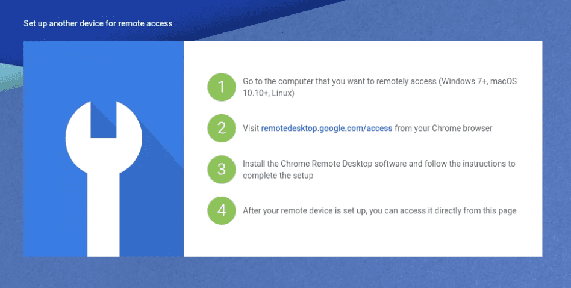

# BestPractices
Code Snippets for every day..

## create a directory tree for github readmes
-L arg is for depth level of main dir
```
tree dir_name/ -L 3 >> tree.txt
```
Copy output into readme inside code quotations
```
dir_name/
├── sub_dir#1
│   └── subsub_dir
│       ├── sample_file#1.txt
│       └── sample_file#2.txt
└── sub_dir#2
    └── subsub_dir
        ├── sample_file#1.txt
        ├── sample_file#2.txt
        └── sample_file#3.txt
```


## freeze pip packages into requirements.txt
```
pip freeze > requirements.txt
```

## erase disk completely and overwrite
```
sudo shred -n 6 -vz /dev/sda1
```
```-n``` 6: Overwrite 6 times instead of the default (25 times). \
```-v``` : Show progress. \
```-z``` : Add a final overwrite with zeros to hide shredding. \

## if you're unable to access the shared folder in VBox
see: https://unix.stackexchange.com/questions/52667/file-permission-issues-with-shared-folders-under-virtual-box-ubuntu-guest-wind

add your user to vboxsf group then reboot
```
usermod -aG vboxsf <youruser>
sudo reboot
```

## set github identity

### set the identity only in this repository
```
git config user.email <you@example.com>
git config user.name <Your Name>
```

### set the identity globaly
```
git config --global user.email <you@example.com>
git config --global user.name <Your Name>
```

### python file header

```
#!/usr/bin/env python3
#-*- coding: utf-8 -*-

'''
description of this script

usage: how to use.. python3 main.py -arg1 <argument>
'''

```

### if chrome remote desktop isn't working on Ubuntu


Simply create the config dir..
`$ mkdir ~/.config/chrome-remote-desktop`
